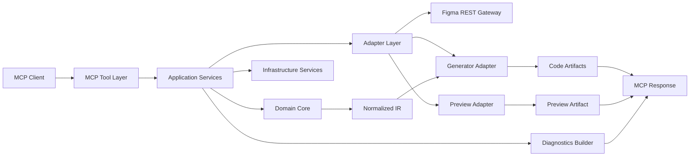

# Figma REST MCP 工具架构概览

本文介绍当前 Figma REST MCP 服务的整体架构、分层职责和对外能力，便于快速理解系统如何把 Figma 节点转换为多端代码。

## 架构目标

这套服务重点解决三件事：

- 为 MCP 调用方提供稳定、可预测的工具接口
- 把 Figma REST 原始响应收敛为稳定的内部快照与中间表示
- 在生成代码的同时输出 preview、warnings 与 diagnostics

## 分层结构

系统按五层组织：

1. `MCP Tool Layer`
2. `Application Layer`
3. `Domain Layer`
4. `Adapter Layer`
5. `Infrastructure Layer`

总体关系如下：

## 各层职责

### MCP Tool Layer

负责：

- 注册工具
- 校验输入 schema
- 调用用例服务
- 映射标准错误与标准输出

这一层只处理协议边界，不承担 Figma 请求与代码生成逻辑。

### Application Layer

负责一次完整请求的编排，例如：

1. 解析来源参数
2. 创建请求上下文
3. 读取能力快照
4. 拉取源节点快照
5. 归一化为内部表示
6. 生成代码与预览
7. 汇总 diagnostics

### Domain Layer

负责核心领域模型与转换规则，包括：

- `SourceSnapshot`
- `NormalizedTree`
- warnings 与 degradation records
- diagnostics 与 timing 结构

这一层不依赖 MCP、HTTP 或 Figma 插件运行时。

### Adapter Layer

负责把外部系统和现有生成能力接入服务，包括：

- Figma 链接解析
- Figma REST 数据读取
- 资源下载与本地路径物化
- 多端 generator 适配
- preview 适配

### Infrastructure Layer

负责横切能力：

- 配置
- 缓存
- HTTP 客户端
- 日志
- 限流
- tracing 与 metrics

## 对外工具

服务只暴露两个 MCP 工具：

- `figma_to_code_convert`
- `figma_to_code_convert_help`

这样的设计可以保持接口稳定，并把解析、抓取、标准化、生成等内部步骤收敛在服务内部。

## 主转换链路

一次 `figma_to_code_convert` 调用通常包含以下阶段：

1. 解析 `source.url`
2. 读取 Figma REST snapshot
3. 构建 `SourceSnapshot`
4. 标准化为 `NormalizedTree`
5. 生成目标 framework 代码
6. 生成 preview
7. 汇总 diagnostics 与 warnings

## 能力与诊断

服务会同时返回结果质量相关的信息，例如：

- 当前 framework 是否支持对应能力
- 哪些功能发生了降级
- 哪些 warning 影响展示 fidelity
- 各主要阶段的 timing

这让调用方不仅能拿到代码，也能理解结果边界。

## 支持的输出方向

当前支持的 framework 包括：

- `HTML`
- `Tailwind`
- `Flutter`
- `SwiftUI`
- `Compose`

## 相关设计文档

如果你要继续看实现细节，建议结合以下专题文档：

- [模块说明](figma-rest-mcp-module-implementation.zh-CN.md)
- [渲染语义预处理方案](render-semantics-preprocess-plan.zh-CN.md)
- [本地资源能力说明](local-asset-download-plan.md)

调用 `figma_to_code_convert` 前，建议先通过 `figma_to_code_convert_help` 获取请求模板和字段说明。
