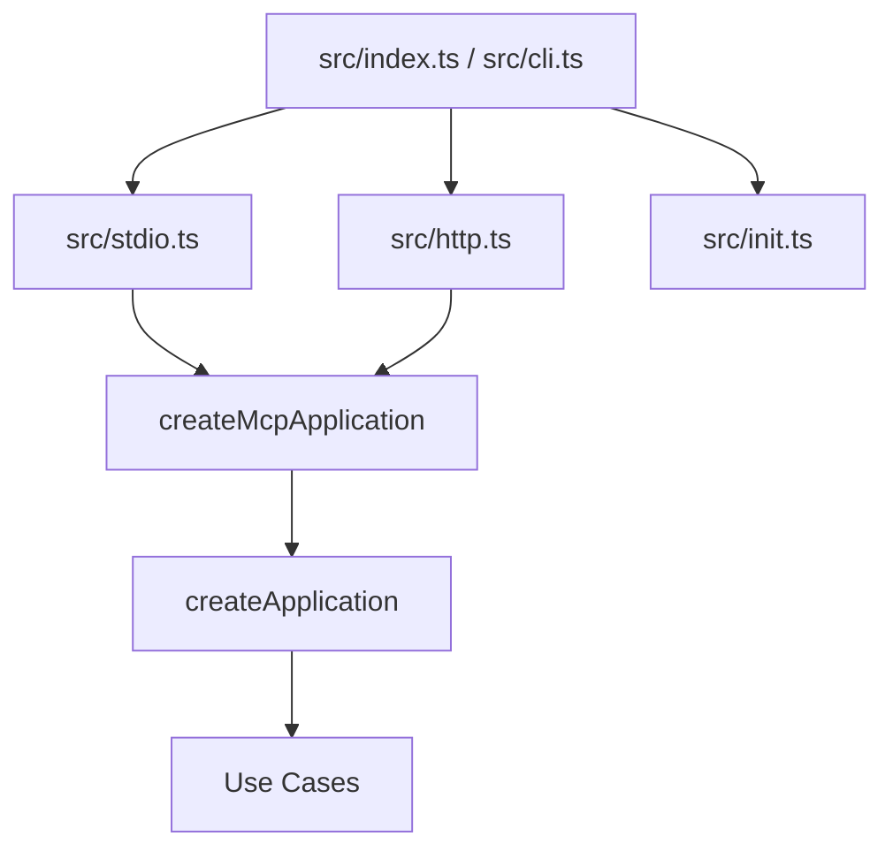
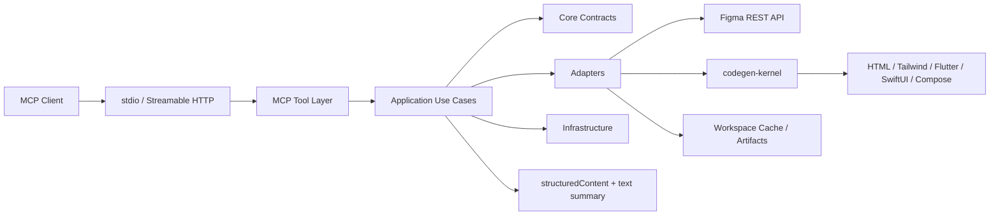
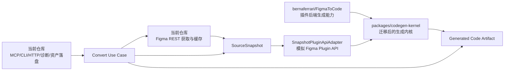
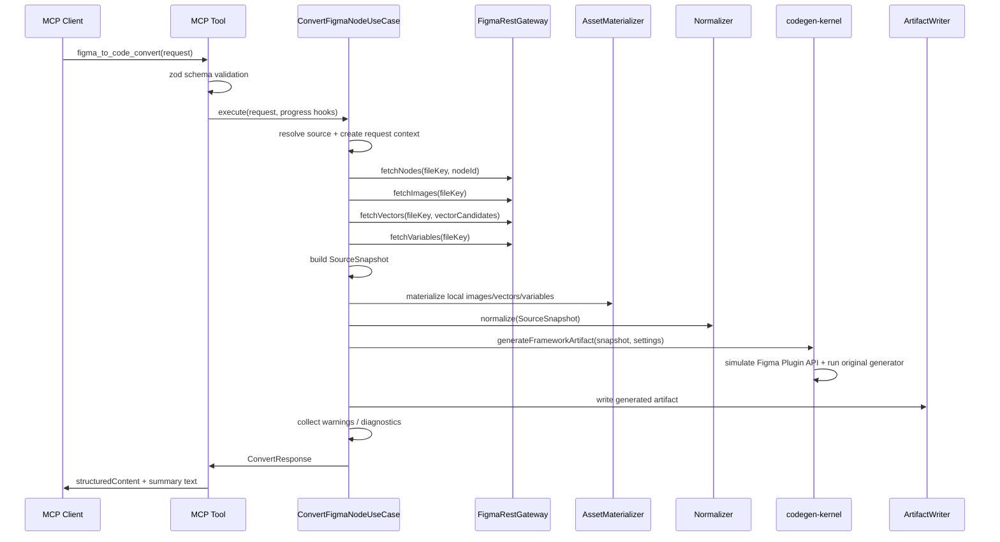
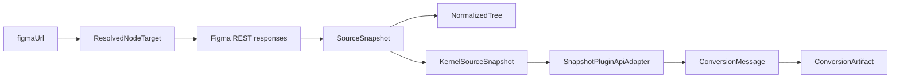
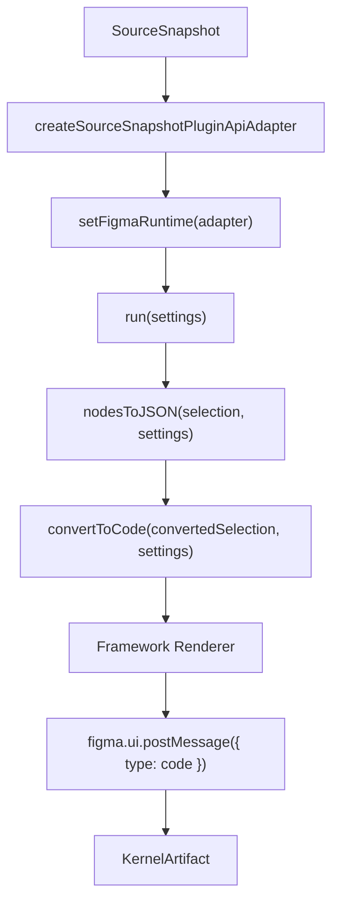
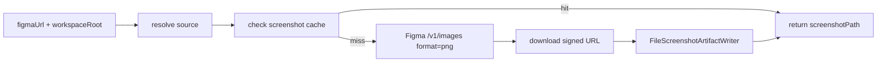

# Anchor D2C MCP 工程架构与实现方案

本文面向实现方案分享，介绍当前工程如何通过 Figma REST API 把单个 Figma 节点转换为多端代码。内容覆盖产品入口、工程分层、核心数据流、代码生成内核、缓存与资产、诊断体系、质量治理和扩展点。

## 1. 项目定位

`anchor-d2c-mcp` 是一个面向 MCP 客户端的 Figma to Code 服务。调用方提供一个包含 `node-id` 的 Figma 单节点链接，服务负责拉取 Figma REST 数据、构建内部快照、调用代码生成内核，并把生成结果写入调用方工作区缓存目录。

当前支持的输出目标：

| framework | generationMode |
|---|---|
| `HTML` | `html`, `jsx`, `styled-components`, `svelte` |
| `Tailwind` | `html`, `jsx`, `twig` |
| `Flutter` | `fullApp`, `stateless`, `snippet` |
| `SwiftUI` | `preview`, `struct`, `snippet` |
| `Compose` | `snippet`, `composable`, `screen` |

工程重点解决四类问题：

- 把 Figma REST API 封装为稳定的 MCP 工具能力。
- 用 `SourceSnapshot` 屏蔽 REST 数据与 Figma Plugin API 的差异。
- 复用原 FigmaToCode 的多端代码生成器，降低迁移成本。
- 用 warnings、degradations、diagnostics 暴露转换质量边界。

## 2. 仓库结构

当前仓库是 `pnpm + turbo + TypeScript` monorepo。

```text
.
├── apps/
│   └── figma-rest-mcp-server/     # MCP 服务、CLI、HTTP/stdio 入口、REST 访问和请求编排
├── packages/
│   ├── codegen-kernel/            # FigmaToCode 生成内核与 REST snapshot 运行时适配
│   └── codegen-types/             # 共享类型
├── docs/                          # 架构、模块、专项设计文档
├── package.json                   # workspace 脚本入口
├── pnpm-workspace.yaml
└── turbo.json
```

三个工作区职责如下：

| 工作区 | 职责 |
|---|---|
| `apps/figma-rest-mcp-server` | 对外产品层。提供 CLI、MCP 工具、HTTP/stdio transport、Figma REST gateway、缓存、资产落盘、diagnostics 和 artifact 写入。 |
| `packages/codegen-kernel` | 代码生成内核。模拟 Figma Plugin API，运行原有 FigmaToCode 转换逻辑，并输出 HTML/Tailwind/Flutter/SwiftUI/Compose。 |
| `packages/codegen-types` | 共享类型包，供生成内核复用。 |

## 3. 运行形态

服务通过统一 CLI 暴露：

```bash
anchor-d2c-mcp init codex
anchor-d2c-mcp init claude
anchor-d2c-mcp init opencode
anchor-d2c-mcp stdio
anchor-d2c-mcp http
anchor-d2c-mcp help
anchor-d2c-mcp --version
```

运行模式：

- `stdio`：用于 Codex、Claude、OpenCode 等 MCP 客户端本地调用。
- `http`：基于 MCP Streamable HTTP transport，默认监听 `127.0.0.1:3101`，并提供 `/health` 与 `/mcp`。
- `init`：向目标客户端写入 MCP 配置，并注入 `FIGMA_ACCESS_TOKEN` 等环境变量。

入口关系：



## 4. 总体架构

工程采用“协议边界 + 应用编排 + 领域契约 + 适配器 + 基础设施 + 生成内核”的结构。



各层边界：

| 层 | 代码位置 | 主要职责 |
|---|---|---|
| MCP Tool Layer | `src/mcp` | 注册 MCP 工具、定义 zod schema、转换成功/错误响应、处理 `structuredContent` 与文本 fallback。 |
| Application Layer | `src/application` | 完整请求编排、依赖组装、request context、diagnostics 构建。 |
| Core Layer | `src/core` | 稳定领域契约、错误结构、warning/degradation、timing、接口定义。 |
| Adapter Layer | `src/adapters` | Figma URL 解析、REST gateway、snapshot 构建、本地资产、normalizer、generator bridge、artifact writer。 |
| Infrastructure Layer | `src/infrastructure` | 环境配置、HTTP client、限流、缓存、日志、metrics、workspace 路径。 |
| Codegen Kernel | `packages/codegen-kernel` | 将 REST snapshot 适配成 Figma Plugin API 环境，复用原生成器输出多端代码。 |

### 4.1 与上游 FigmaToCode 的能力边界

当前仓库的代码生成能力参考并迁移自 [bernaferrari/FigmaToCode](https://github.com/bernaferrari/FigmaToCode)。上游项目定位是 Figma 插件：在 Figma 插件运行时中读取用户选中的 native nodes，先转换为 JSON，再转换为 `AltNodes` 中间表示，做布局优化，最后生成 `HTML`、`React (JSX)`、`Svelte`、`styled-components`、`Tailwind`、`Flutter`、`SwiftUI` 等目标代码。上游 monorepo 的核心业务逻辑位于 `packages/backend`，插件 UI 位于 `packages/plugin-ui`，最终由 `apps/plugin` 组装成 Figma 插件。

当前仓库不是直接运行 Figma 插件，而是把上游生成能力服务化为 MCP 工具。因此总体架构可以按“生成内核复用 + 服务端适配自研”来理解：



能力来源拆分如下：

| 架构能力 | 主要来源 | 当前仓库中的落点 | 说明 |
|---|---|---|---|
| 多端 renderer | 上游 FigmaToCode | `packages/codegen-kernel/src/html`, `tailwind`, `flutter`, `swiftui`, `compose` | 继承上游按 framework 分发和输出代码的核心能力，并在当前仓库内继续修复 Tailwind/HTML 等输出质量问题。 |
| 节点转 JSON / AltNodes | 上游 FigmaToCode | `packages/codegen-kernel/src/altNodes`, `src/code.ts`, `src/common/retrieveUI` | 继承上游“native nodes -> JSON/AltNodes -> code”的生成主线。 |
| 通用样式与布局转换 | 上游 FigmaToCode + 当前仓库修复 | `packages/codegen-kernel/src/common`, 各 framework `builderImpl` | 基础转换逻辑来自上游；当前仓库增加了 REST 场景下的图片填充、mask、SVG 合并、auto-layout、圆形 image fill 等修复。 |
| Figma Plugin API 类型与运行假设 | 上游 FigmaToCode / Figma 插件生态 | `plugin-api.d.ts`, `figma-plugin-typings.d.ts`, `pluginTypes.ts` | 保留插件侧类型门面，便于继续复用上游生成代码。 |
| REST snapshot 到插件运行时适配 | 当前仓库 | `packages/codegen-kernel/src/runtime/sourceSnapshotAdapter.ts`, `runWithSourceSnapshot.ts`, `figma.ts` | 当前仓库新增的关键桥接层，用 `SourceSnapshot` 构造最小 Figma runtime，让上游生成器可以在 Node 服务端运行。 |
| Figma REST API 访问 | 当前仓库 | `apps/figma-rest-mcp-server/src/adapters/figmaRestGateway.ts` | 服务端通过 REST 拉取节点、图片、SVG、变量、截图，不依赖 Figma 插件环境。 |
| MCP 工具协议 | 当前仓库 | `src/mcp`, `src/stdio.ts`, `src/http.ts` | 将转换能力包装为 MCP tools，并支持 stdio 与 Streamable HTTP。 |
| CLI 与客户端初始化 | 当前仓库 | `src/cli.ts`, `src/init.ts`, `src/product.ts` | 提供 `anchor-d2c-mcp init/stdin/http/help/version` 等产品化入口。 |
| 工作区缓存与 artifact 写入 | 当前仓库 | `src/infrastructure/*`, `fileCodeArtifactWriter.ts`, `fileScreenshotArtifactWriter.ts` | 生成代码、REST JSON、本地资产和截图统一写入 `<workspaceRoot>/.figma-to-code/cache/`。 |
| 本地图片 / SVG / 变量资产物化 | 当前仓库 | `src/adapters/localAssets/*`, `LocalAssetMaterializer` | 当前仓库新增，解决 MCP 场景下离线引用、稳定相对路径和资产 manifest。 |
| 能力探测、warnings、diagnostics | 当前仓库 | `capabilityProbe.ts`, `WarningCollector`, `diagnosticsBuilder.ts` | 上游插件有 warning 概念；当前仓库扩展为服务端能力快照、降级决策、阶段 timing 和标准错误响应。 |
| render semantics 预处理 | 当前仓库 | `packages/codegen-kernel/src/common/renderSemantics.ts` | 当前仓库后续新增的共享质量治理 pass，用于修复 group flatten、mask 边界、局部坐标语义丢失等 REST/renderer 共性问题。 |
| 截图工具 | 当前仓库 | `figma_to_code_fetch_screenshot`, `FileScreenshotArtifactWriter` | 当前仓库新增的独立 MCP 工具，直接调用 Figma image export 获取节点 PNG。 |

从提交历史也能看到这条演进路线：

| 提交 | 体现的架构变化 |
|---|---|
| `0094d41 Initial import of FigmaToCode MCP server` | 初始导入服务端骨架、`codegen-kernel`、REST gateway、MCP 层、snapshot/runtime adapter 和测试夹具。 |
| `f5b5f4b 统一 cli 命令，增加发布打包` | 将服务包装为统一 CLI 和 npm 包，补齐 `init`、`stdio`、`http`、版本信息和发布构建。 |
| `9739b45 1.简化入参，改成环境变量...` | 收敛 MCP 请求入参，把图片/向量/变量等选项转为服务端环境配置。 |
| `7ea5e69 1.修复 group 被拍平导致的布局信息丢失...` | 在 `codegen-kernel` 新增 `renderSemantics` pass，说明当前仓库开始在上游 renderer 基础上做共享质量治理。 |
| `e1c3f08 1.ENABLE_VARIABLES=false时不额外请求 variables...` | 优化 REST/本地资产降级策略，减少不必要变量请求并允许单张图片失败后继续转换。 |
| `1576f37 新增获取 figma 截图工具` | 新增独立 screenshot MCP 工具和缓存写入链路。 |
| `1cf6c27 1、新增状态变量将structuredContent字段放到 text 里...` | 增强 MCP 客户端兼容性，通过 `MCP_TEXT_FALLBACK` 适配不展示 `structuredContent` 的客户端。 |

因此，分享实现方案时可以把上游 FigmaToCode 视为“插件时代的生成引擎”，把当前仓库视为“REST + MCP 时代的服务化外壳、运行时桥接、缓存资产体系和质量诊断层”。两者的关键分界是：上游负责“如何把 Figma 节点表达成目标代码”，当前仓库负责“如何在没有 Figma 插件运行时的服务端环境中稳定获得节点、模拟运行时、管理资产、对外暴露工具并解释质量边界”。

## 5. 对外 MCP 工具

当前公开三个 MCP 工具：

| 工具 | 作用 |
|---|---|
| `figma_to_code_convert` | 主转换工具。输入 Figma 节点 URL、workspaceRoot、framework、generationMode，输出生成代码路径、warnings、可选 diagnostics。 |
| `figma_to_code_fetch_screenshot` | 独立截图工具。通过 Figma image export 获取节点 PNG，并缓存到工作区。 |
| `figma_to_code_convert_help` | 返回请求样例、字段说明、合法 generationMode 和注意事项。 |

`figma_to_code_convert` 的响应核心字段：

```ts
interface ConvertResponse {
  framework: "HTML" | "Tailwind" | "Flutter" | "SwiftUI" | "Compose";
  code: string;          // 相对 workspaceRoot 的生成文件路径
  warnings: string[];
  preview?: {
    width: number;
    height: number;
    html: string;
  };
  diagnostics?: DiagnosticsReport;
}
```

当前公开转换链路固定 `returnPreview: false`，`preview` 相关适配器和 schema 仍保留为内部扩展点。

## 6. 主转换链路

一次 `figma_to_code_convert` 请求会经过以下阶段：



应用层的实际编排集中在 `ConvertFigmaNodeUseCase.execute`：

1. 创建 traceId、stage timer、warning collector。
2. 读取服务能力快照，并按请求 framework 收窄。
3. 解析 `figmaUrl`，得到 `fileKey` 和标准化后的 `nodeId`。
4. 拉取 Figma 节点、图片映射、向量 SVG、变量元数据。
5. 构建 `SourceSnapshot`，并按配置下载本地图片、SVG、变量中间产物。
6. 按 snapshot 丰富请求级 capability。
7. 归一化为 `NormalizedTree`。
8. 调用 `codegen-kernel` 生成目标代码。
9. 将代码写入 `.figma-to-code/cache/generated/<traceId>/`。
10. 汇总 warnings，按配置生成 diagnostics。

## 7. 核心数据模型

转换链路中的关键数据结构如下：



### `ResolvedNodeTarget`

由 `FigmaLinkParserAdapter` 从 URL 解析得到：

- `fileKey`
- `nodeIds`
- 原始 URL
- source kind

当前公开工具只支持单节点 URL，但内部结构使用 `nodeIds: string[]`，为后续多节点扩展预留空间。

### `SourceSnapshot`

`SourceSnapshot` 是服务层与生成内核之间最重要的边界对象，包含：

- Figma file key 和目标 node ids。
- REST 返回的 source nodes。
- 图片引用、图片 URL、本地图片路径。
- 可导出的 vector candidates、SVG 内容、本地 SVG 路径。
- 本地 vector root 与 child 映射。
- Figma variables 原始响应。
- 本地资产 manifest 路径。
- 抓取时间和请求次数等 metadata。

这个结构的价值是把 Figma REST API 的多端点响应收敛成一次生成所需的稳定输入。

### `NormalizedTree`

`NormalizationAdapter` 将 snapshot 转为服务内部的 `NormalizedTree`。它不是最终生成器直接使用的唯一输入，但用于：

- 统一几何、布局、文本、变量、资产 hint。
- 在应用层判断图片/向量是否存在，决定是否添加 degradation。
- 为 diagnostics 和后续扩展提供稳定 IR。

normalizer 目前按多个 pass 组织：

- structural pass：过滤不可见节点。
- geometry pass：计算相对坐标、尺寸、累计旋转和布局字段。
- text pass：提取文本和文本分段。
- variable pass：解析变量绑定与降级状态。
- asset hint pass：关联 image/vector hints。
- naming pass：生成稳定 `uniqueName`。

### `ConversionArtifact`

生成器返回：

- `framework`
- `code`
- `warnings`
- 可选 `preview`

随后 `FileCodeArtifactWriter` 会把 `code` 从源码内容改写为工作区相对文件路径。

## 8. Figma REST 访问与缓存

REST 访问由 `FigmaRestGateway` 统一负责，底层使用 `HttpClient`。

主要端点：

| 能力 | Figma API |
|---|---|
| 节点 JSON | `/v1/files/:fileKey/nodes?ids=...&geometry=paths` |
| 文件图片映射 | `/v1/files/:fileKey/images` |
| SVG 导出 | `/v1/images/:fileKey?ids=...&format=svg` 后再下载 signed URL |
| 变量 | `/v1/files/:fileKey/variables/local` |
| 截图 | `/v1/images/:fileKey?ids=...&format=png` 后再下载 signed URL |
| 认证探测 | `/v1/me` |

缓存分三层：

| 缓存 | 位置 | 用途 |
|---|---|---|
| request cache | 进程内单次请求 | 避免同一请求内重复调用相同资源。 |
| memory cache | 进程内 TTL LRU | 节点、图片、向量、变量、认证探测等热点复用。 |
| workspace disk cache | `<workspaceRoot>/.figma-to-code/cache/rest/` | `useCache=true` 时跨请求复用 REST 结果。 |

HTTP 客户端具备：

- 总超时预算。
- 429 和 5xx 重试。
- `retry-after` 识别。
- 指数退避风格的固定 backoff。
- `HTTP_MAX_CONCURRENCY` 并发门控。
- 标准化 `ServiceError`。

## 9. 本地资产处理

本地资产由 `LocalAssetMaterializer` 处理，输出目录：

```text
<workspaceRoot>/.figma-to-code/cache/assets/<fileKey>/<nodeSlug>/
```

处理目标：

- 图片：收集 `imageRef`，下载到本地，并在 snapshot 写入 `localImagePaths`。
- 向量：识别 vector root，导出 SVG，记录 `localVectorPaths` 与 `localVectorRootMappings`。
- 变量：在启用变量能力时保存变量引用、响应和 manifest。

这个能力放在 `fetch_snapshot` 阶段末尾，原因是：

- MCP 请求 schema 保持简单。
- `codegen-kernel` 不需要关心下载流程。
- snapshot 进入生成阶段前已经具备稳定资源映射。

如果图片或向量的普通 REST 获取失败，后续本地下载成功会清理之前的 fetch warning；如果本地下载失败，则保留降级 warning 并继续使用现有远程资源流程。

## 10. 代码生成内核

`packages/codegen-kernel` 的核心策略是“复用原插件生成器，而不是重写全部 renderer”。



### Plugin API 适配

`createSourceSnapshotPluginApiAdapter` 用 snapshot 构造一个最小可用的 Figma runtime：

- `figma.currentPage.selection`
- `figma.getNodeByIdAsync`
- `figma.getSelectionColors`
- `figma.getImageByHash`
- `figma.variables.getVariableById`
- 节点级 `exportAsync`
- 文本级 `getStyledTextSegments`

对本地资产的支持也是在这里注入到节点上的：

- `localImagePath`
- `localVectorPath`
- `isLocalVectorChild`
- `localVectorRootId`
- `canBeFlattened`

这样原生成器可以像运行在 Figma 插件里一样读取 selection、导出 SVG、解析文本分段和变量。

### Renderer 入口

`code.ts` 的 `run(settings)` 是生成主入口：

1. 读取 `figma.currentPage.selection`。
2. 将 selection 转为 AltNode / JSON 节点。
3. 调用 `convertToCode` 分发到目标 framework renderer。
4. 生成 HTML preview。
5. 收集颜色、渐变和 warnings。
6. 通过 `figma.ui.postMessage` 输出 `ConversionMessage`。

`generateFrameworkArtifact` 捕获最后一条 `type: "code"` 消息，并转换成服务需要的 `KernelArtifact`。

## 11. 渲染质量治理

由于 Figma REST 与插件运行时存在差异，生成质量的核心挑战不是“能否输出代码”，而是“如何避免结构语义在转换中丢失”。

当前已经落地的关键机制是 `renderSemantics` pass，位于：

```text
packages/codegen-kernel/src/common/renderSemantics.ts
```

它在 HTML/Tailwind renderer 入口前为节点标注：

- 是否需要保留 wrapper。
- 是否建立局部坐标系。
- 是否依赖子节点 offset。
- 是否是 mask 边界。
- 是否允许 flatten。
- 是否允许 merge。

典型规则：

- 节点是 auto-layout 父节点中的 flow item，需要保留 wrapper。
- 多个子节点依赖局部 x/y 关系，需要保留 wrapper。
- mask 边界、clips content、显式视觉样式都需要保留 wrapper。
- mask 边界和局部坐标根默认禁止 flatten。
- 有多个图片或非安全子类型时禁止 merge。

HTML/Tailwind renderer 消费这些标记：

- `shouldPreserveNodeWrapper`
- `shouldAllowNodeFlatten`
- `shouldAllowNodeMerge`

这个方案把“结构 wrapper 是否保留”和“图形是否可 flatten”拆成两条规则，避免不同 renderer 分别临时判断导致回归。

## 12. Diagnostics、Warnings 与错误模型

服务用三种粒度表达质量边界：

| 类型 | 作用 |
|---|---|
| `warnings: string[]` | 给调用方的简短问题列表。 |
| `DegradationRecord` | 记录某项能力在哪个阶段降级，以及是否影响 correctness/fidelity。 |
| `FeatureDecision` | 记录某项能力是否被请求、是否生效、支持级别和原因。 |

`WarningCollector` 会去重 warnings、degradations 和 decisions。`DefaultDiagnosticsBuilder` 在 `INCLUDE_DIAGNOSTICS=true` 时输出：

- adapter 类型。
- source file key。
- source node ids。
- source node count。
- decisions。
- stage timing。
- traceId。

错误统一为 `ServiceError`：

- `ToolValidationError`
- `AuthenticationError`
- `AuthorizationError`
- `SourceNotFoundError`
- `UnsupportedFeatureError`
- `ConversionFailedError`
- `InternalServiceError`

MCP 工具层会把错误转为标准 `isError` 响应，同时保留 structuredContent。

## 13. 工作区输出

所有可复用产物都写入调用方提供的 `workspaceRoot`：

```text
<workspaceRoot>/.figma-to-code/
└── cache/
    ├── rest/          # Figma REST JSON 缓存
    ├── assets/        # 图片、SVG、变量 manifest 等本地资产
    ├── generated/     # 生成代码
    └── screenshot/    # 节点截图
```

生成代码路径示例：

```text
.figma-to-code/cache/generated/<traceId>/tailwind.jsx
```

截图路径示例：

```text
.figma-to-code/cache/screenshot/<fileKey>/<nodeId>/Preview.png
```

工具响应中返回相对 `workspaceRoot` 的路径；如果输出不在 workspace 内，则返回绝对路径。

## 14. 配置体系

配置集中在 `src/infrastructure/config.ts`，通过 zod 从环境变量读取并校验。

关键配置：

| 环境变量 | 默认值 | 作用 |
|---|---:|---|
| `FIGMA_ACCESS_TOKEN` | 无 | Figma API token，启动必需。 |
| `FIGMA_API_BASE_URL` | `https://api.figma.com` | Figma API 基地址。 |
| `HTTP_TIMEOUT_MS` | `60000` | 单次请求总超时预算。 |
| `HTTP_RETRY_MAX` | `2` | HTTP 重试次数。 |
| `HTTP_MAX_CONCURRENCY` | `6` | Figma HTTP 并发上限。 |
| `CACHE_TTL_MS` | `300000` | 通用内存缓存 TTL。 |
| `CACHE_MAX_ENTRIES` | `500` | 内存缓存最大条目数。 |
| `ENABLE_VARIABLES` | `false` | 是否启用变量能力。 |
| `INCLUDE_DIAGNOSTICS` | `false` | 是否返回 diagnostics。 |
| `ENABLE_IMAGE_EMBED` | `true` | 是否启用图片嵌入。 |
| `ENABLE_VECTOR_EMBED` | `true` | 是否启用向量嵌入。 |
| `DOWNLOAD_IMAGES_TO_LOCAL` | `true` | 是否下载图片到本地 workspace。 |
| `DOWNLOAD_VECTORS_TO_LOCAL` | `true` | 是否下载向量 SVG 到本地 workspace。 |
| `MCP_TEXT_FALLBACK` | `false` | 是否把结构化结果同步追加到 MCP 文本响应。 |
| `ROUND_TAILWIND_VALUES` | `true` | Tailwind 数值是否近似映射。 |
| `ROUND_TAILWIND_COLORS` | `true` | Tailwind 颜色是否近似映射。 |

`createApplication` 会把这些配置转换为默认 `ConversionOptions`，再被每次请求的 `generationMode` 覆盖。

## 15. 截图工具链路

`figma_to_code_fetch_screenshot` 是一条独立旁路：



它不执行 normalize，也不调用 codegen-kernel。适用场景是让调用方拿到 Figma 原始渲染截图，用于人工对比或后续视觉验证。

## 16. 测试与质量保障

测试位于 `apps/figma-rest-mcp-server/test` 和 `packages/codegen-kernel/src/**/*.test.ts`，分为：

| 类型 | 位置 | 覆盖内容 |
|---|---|---|
| unit | `test/unit`, `src/**/*.test.ts` | 单模块逻辑，例如 URL 解析、gateway、normalizer、asset materializer、render semantics。 |
| contract | `test/contract` | MCP handler、颜色变量、本地资产输出、framework golden。 |
| e2e | `test/e2e` | 使用真实/固定 fixture 验证完整转换链路。 |
| golden | `test/golden` | 多 framework 输出快照，防止生成结果意外变化。 |

根目录脚本：

```bash
pnpm test
pnpm type-check
pnpm lint
pnpm build
```

发布包位于 `apps/figma-rest-mcp-server`，包名为 `anchor-d2c-mcp`，使用 `tsup` 构建 ESM 与类型声明。

## 17. 扩展点

常见扩展方向和落点：

| 需求 | 推荐落点 |
|---|---|
| 新增 MCP 工具 | `src/mcp/schemas.ts`, `src/mcp/server.ts`, `src/application/useCases.ts` |
| 新增 framework | `core/contracts.ts`, `mcp/convertToolMetadata.ts`, `codegen-kernel` renderer 与 `convertToCode` 分发 |
| 新增 Figma REST 能力 | `SourceGateway` 接口、`FigmaRestGateway`、`SourceSnapshot`、`SourceSnapshotAdapter` |
| 新增本地资产类型 | `LocalAssetMaterializer`、workspace path、snapshot 字段、kernel adapter 节点装饰 |
| 改进转换质量 | `codegen-kernel/src/common` 共享 pass，优先避免只在单个 renderer 里修补 |
| 增加 diagnostics | `WarningCollector`、`DefaultDiagnosticsBuilder`、相关 use case stage |
| 调整缓存策略 | `MemoryCache`、`WorkspaceRestCacheStore`、gateway cache key |

新增转换能力时建议优先遵守两个原则：

- 服务层负责获取、缓存、诊断和稳定输入；生成层负责表达目标代码。
- 多 renderer 共性的结构语义放在 `codegen-kernel/src/common`，避免 HTML/Tailwind/其他目标各自分叉。

## 18. 当前边界与风险

当前实现已知边界：

- 只公开单节点转换，不支持一次转换 Figma 多层页面结构。
- `file_variables:read` 相关能力受 Figma 企业版权限影响，实际可用性依赖 token 权限。
- REST snapshot 与插件运行时仍存在差异，生成结果可能与原 Figma 插件版不完全一致。
- 当前验证重点在 Tailwind，其他 framework 需要继续补充 golden 与真实案例验证。
- SVG 通过 effects 设置阴影时，Figma 导出的 SVG 尺寸可能和原始节点不一致。
- vector mask 仍是弱点，当前更接近普通 Rectangle mask 处理。
- preview 相关内部模块保留，但公开 convert 工具暂不返回 preview。

## 19. 分享时的实现主线

如果用于方案分享，可以按下面主线展开：

1. 为什么选择 MCP：让设计转代码能力可以直接被 Codex、Claude、OpenCode 等客户端调用。
2. 为什么选择 REST snapshot：服务端没有 Figma 插件运行时，需要从 REST API 构建稳定输入。
3. 为什么复用 FigmaToCode 内核：避免重写多端 renderer，通过 Plugin API adapter 降低迁移成本。
4. 一次 convert 请求如何流转：URL 解析、REST 抓取、snapshot、本地资产、normalization、kernel、artifact。
5. 如何治理质量边界：warnings、degradations、diagnostics、render semantics、golden tests。
6. 后续演进：扩大 framework 验证、完善变量和 mask、开放 preview、多节点/页面级转换。
